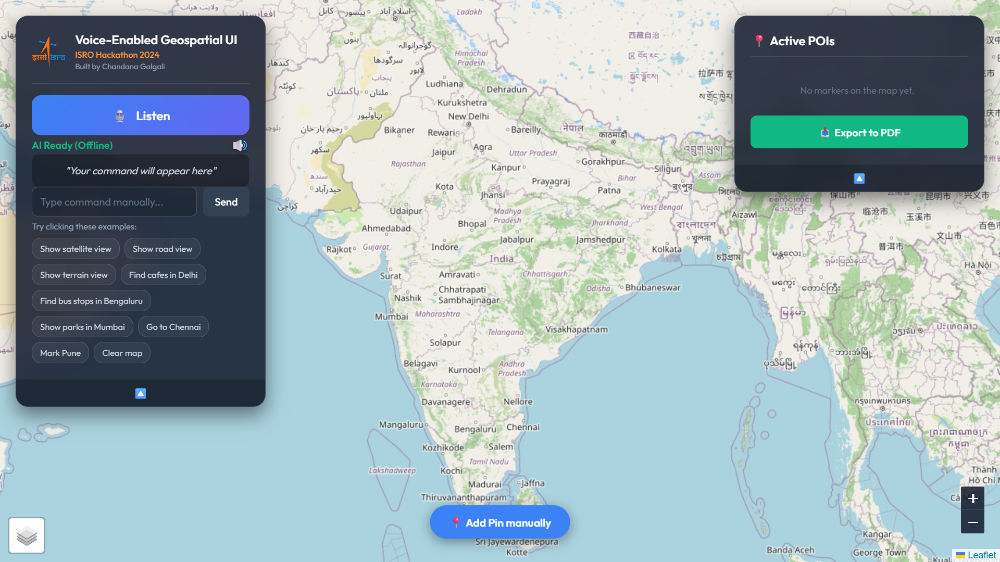
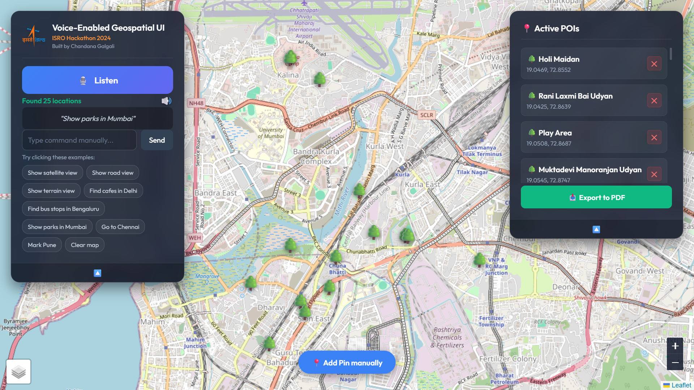

# 🛰️ Voice-Enabled Geospatial UI


> **Official Submission for the ISRO Bharatiya Antariksh Hackathon 2024**  
> **Problem Statement:** Voice Enabled User Interface for Geospatial Map Based Web Applications

A highly responsive, voice-controlled geospatial web explorer that allows users to navigate maps, discover real-time Points of Interest (POIs), switch map layers, and export geospatial data entirely through natural language voice commands. 

---

## 🚀 Live Demo

**Experience the application live:**  
👉 **[Click here to open the Voice Geospatial UI](https://voice-enabled-geospatial-ui.netlify.app/)**  
*(Note: Please use Google Chrome or Microsoft Edge and grant microphone permissions for optimal voice recognition).*

---

## 📸 Application Overview




---

## ✨ Core Features

*   **🎙️ Offline Machine Learning Voice Engine:** Powered by an edge-optimized **Whisper AI model** (`Xenova/whisper-base.en`) via Transformers.js. The entire speech-to-text pipeline runs locally inside the browser, ensuring high accuracy and zero cloud API costs.
*   **🌍 Real-Time POI Discovery:** Fetches live geospatial data (Hospitals, Cafes, ATMs, Parks, etc.) directly from the **OpenStreetMap (OSM) Overpass API** within a targeted radius.
*   **📍 Smart Marker Management:** 
    *   Add pins via voice commands.
    *   Remove specific pins by naming them.
    *   Utilize the "Manual Pin Drop" crosshair UI with automatic reverse-geocoding.
*   **🗺️ Dynamic Layer Controls:** Seamlessly switch between Satellite, Topographical (Terrain), and Street map views via voice commands or intuitive on-screen toggles.
*   **📥 PDF Data Export:** Automatically generates formatted, tabular PDF reports (via jsPDF) of all active map markers, including precise coordinates and Google Maps routing links.
*   **📱 Fully Responsive Glassmorphic UI:** A premium, modern dashboard aesthetic that adapts flawlessly to desktop, tablet, and mobile devices without overlapping map controls.

---

## 🗣️ Voice Command Reference

Click the **Listen** button and try any of the following conversational commands:

| Action Category | Example Voice Commands |
| :--- | :--- |
| **Map Navigation** | `"Zoom to Mumbai"`, `"Go to Delhi"`, `"Find Bangalore"` |
| **POI Discovery** | `"Find cafes near Pune"`, `"Show hospitals in Chennai"`, `"Search for ATMs around Surat"` |
| **Layer Switching** | `"Show satellite view"`, `"Show terrain view"`, `"Show road view"` |
| **Adding Markers** | `"Drop a marker at Hyderabad"`, `"Put a marker in Ahmedabad"`, `"Mark Jaipur"` |
| **Removing Markers**| `"Unmark Hyderabad"`, `"Remove marker from Pune"`, `"Clear all markers"`, `"Clear map"` |
| **Zoom Controls** | `"Zoom in"`, `"Zoom out"` |

---

## 🛠️ Tech Stack & Architecture

*   **Frontend Interface:** HTML5, CSS3 (Custom Glassmorphism UI, Responsive Media Queries)
*   **Core Logic:** Vanilla JavaScript (ES6+ Module Architecture)
*   **Mapping Engine:** [Leaflet.js](https://leafletjs.com/)
*   **Geospatial Data APIs:** 
    *   *Nominatim API:* Dynamic forward and reverse geocoding.
    *   *Overpass API:* Real-time OSM node/way/relation extraction.
*   **Voice Processing:** Hugging Face Transformers.js (Quantized Whisper-base English Model)
*   **Data Export:** `jsPDF` and `jsPDF-AutoTable`

---

## 💻 Local Setup & Installation

Since this is a client-side web application, no complex backend server setup is required to run it locally.

1. **Clone this repository:**
    ```bash
    git clone [https://github.com/chandana-galgali/Voice-Enabled-Geospatial-UI.git](https://github.com/chandana-galgali/Voice-Enabled-Geospatial-UI.git)
    ```
2. **Navigate to the project directory:**
    ```bash
    cd Voice-Enabled-Geospatial-UI
    ```
3. **Run the application:**
    Simply open `index.html` in any modern web browser.  
    *(For the best development experience, use the "Live Server" extension in VS Code).*

---

## ⚠️ Known Constraints & Architectural Trade-offs

**Public API Rate Limiting & Timeouts**
This application fetches real-time Point of Interest (POI) data using the open-source OSM Overpass API. Because we utilize a public, shared, rate-limited endpoint (`overpass-api.de`), users may occasionally encounter a **"Data too large to fetch"** or **Timeout** error in the UI. 

*   **Why this happens:** To ensure maximum accuracy, our geospatial query searches for Nodes, Ways, and Relations (NWR) and calculates exact geometric centers for massive polygons (like hospitals or airports). In highly dense urban areas, if the global OSM server is under heavy load, it may fail to process these geometric calculations within the application's strict 10-second non-blocking timeout window.
*   **The Workaround:** This is a server-side bandwidth limitation, not an application failure. Waiting a few moments and retrying the exact same voice command will often succeed once the server load drops.
*   **Future Scope:** For a production-scale deployment, this bottleneck would be resolved by hosting a dedicated, private Overpass instance or migrating to an enterprise GIS backend like Mapbox.

---

### 👨‍💻 Developed By
**Chandana Galgali**  
*Built for the ISRO Hack2Skill Bharatiya Antariksh Hackathon 2024.*